# MP3 Reproductor de Música

Angel Guerrero
Diego Godoy
Felipe Argomedo

MP3 es un reproductor de música de consola desarrollado en C++ como parte del Taller 2 de la asignatura Estructuras de Datos. El programa permite cargar un catálogo de canciones desde un archivo de texto, gestionar una lista de reproducción y controlar la reproducción mediante comandos de teclado. El estado del reproductor se guarda automáticamente en un archivo de configuración al realizar cualquier acción.

Para la compilación y ejecución de MP3, se tiene que hacer doble click en el archivo compilar.bat en el explorador de windows/linux/mac.
El script compila todos los archivos fuente y ejecuta el programa automáticamente si la compilación es exitosa.

 ## Archivos necesarios:
Antes de ejecutar asegúrate de tener en la carpeta nucleo:
music_source.txt — listado de canciones

 ## Diagrama de Clases

```mermaid
classDiagram
    %% Clases Centrales del Sistema
    class Sistema {
        +Sistema()
        +menu() void
        +~Sistema()
    }

    class Reproductor {
        -ListaCancion canciones
        -bool reproduciendo
        -NodoCancion* cancionReproduciendo
        -bool modoAleatorio
        -int repeticion
        -ListaCancion listaReproduccion
        -ArbolTrie* buscadorTrie
        -guardar() void
        +Reproductor()
        +getReproduciendo() bool
        +getCancionReproduciendo() NodoCancion*
        +setReproduciendo(bool reproduciendo) void
        +setCancionReproduciendo(NodoCancion* cancionReproduciedo) void
        +leerArchivoCancion(string archivoCancion) void
        +playPause() void
        +pistaAnterior() void
        +pistaSiguiente() void
        +aleatorio() void
        +Repeticion() void
        +ListaReproduccion() void
        +listadoCanciones() void
        +menuBusqueda() void
        +menuRanking() void
        +mezclarLista() void
        +imprimirEstadoActual() void
        +saltarCancion(int posicion) void
        +reproducirSeleccion(int posicion) void
        +agregarCancionReproduccion(int posicion) void
        +agregarCancionRegistro() void
        +eliminarCancion(int posicion) void
        +guardarEstado() void
        +cargarEstado() void
        +inicializar() void
        +reproducirDesdeBusqueda(Cancion* cancion) void
        +mostrarTop10Canciones() void
        +mostrarTop10Artistas() void
        +~Reproductor()
    }

    class Cancion {
        -string id
        -string nombre
        -string artista
        -int duracion
        -int reproducciones
        +Cancion(...)
        +getId() string
        +getNombreCancion() string
        +getArtista() string
        +getDuracion() int
        +getReproducciones() int
        +sumarReproduccion() void
        +~Cancion()
    }

    %% TDA Lista Enlazada
    class ListaCancion {
        -NodoCancion* cabeza
        -NodoCancion* cola
        -int total
        +ListaCancion()
        +insertarFinal(Cancion*) void
        +vaciarLista() void
        +getCabeza() NodoCancion*
        +estaVacia() bool
        +~ListaCancion()
    }

    class NodoCancion {
        -Cancion* cancion
        -NodoCancion* siguiente
        -NodoCancion* anterior
        +NodoCancion(Cancion* cancion)
        +getCancion() Cancion*
        +getSiguiente() NodoCancion*
        +getAnterior() NodoCancion*
        +setSiguiente(NodoCancion*) void
        +setAnterior(NodoCancion*) void
        +~NodoCancion()
    }

    %% TDA Árbol Trie (Búsquedas)
    class ArbolTrie {
        -NodoTrie* raiz
        +ArbolTrie()
        +insertar(string, Cancion*) void
        +buscar(string) ListaCancion*
        +~ArbolTrie()
    }

    class NodoTrie {
        -char caracter
        -ListaCancion* listaCanciones
        -NodoTrie* primerHijo
        -NodoTrie* siguienteHermano
        +NodoTrie(char c)
        +getCaracter() char
        +getListaCanciones() ListaCancion*
        +getPrimerHijo() NodoTrie*
        +getSiguienteHermano() NodoTrie*
        +setCaracter(char c) void
        +setPrimerHijo(NodoTrie* primerHijo) void
        +setSiguienteHermano(NodoTrie* siguienteHermano) void
        +~NodoTrie()
    }

    %% Rankings (Max Heaps)
    class MaxHeap {
        -Cancion** arreglo
        -int capacidad
        -int tamanoActual
        -padre(int i) int
        -hijoIzquierdo(int i) int
        -hijoDerecho(int i) int
        -flotar(int i) void
        -hundir(int i) void
        -intercambiar(int i, int j) void
        -esMayor(Cancion* cancion1, Cancion* cancion2) bool
        -minuscula(string palabra) string
        +MaxHeap(int capacidadMaxima)
        +insertar(Cancion* cancion) void
        +extraerMaximo() Cancion*
        +estaVacio() bool
        +~MaxHeap()
    }

    class MaxHeapArtista {
        -Artista** arreglo
        -int capacidad
        -int tamanoActual
        -padre(int i) int
        -intercambiar(int i, int j) void
        -flotar(int i) void
        -hundir(int i) void
        -esMayor(Artista* a1, Artista* a2) bool
        +MaxHeapArtista(int capacidad)
        +insertar(Artista* artista) void
        +extraerMaximo() Artista*
        +estaVacio() bool
        +~MaxHeapArtista()
    }

    %% Clases del Artista (Árbol AVL)
    class Artista {
        -string nombre
        -int reproduccionesTotales
        -ArbolAVL* canciones
        -Artista* siguiente
        +Artista(string nom)
        +getNombre() string
        +getReproduccionesTotales() int
        +getCanciones() ArbolAVL*
        +getSiguiente() Artista*
        +setReproduccionesTotales(int total) void
        +setSiguiente(Artista* sig) void
        +agregarCancion(Cancion* c) void
        +~Artista()
    }

    class ArbolAVL {
        -NodoAVL* raiz
        -altura(NodoAVL* altura) int
        -max(int a, int b) int
        -rotacionDerecha(NodoAVL* der) NodoAVL*
        -rotacionIzquierda(NodoAVL* izq) NodoAVL*
        -obtenerBalance(NodoAVL* n) int
        -insertar(NodoAVL* nodo, Cancion* cancion) NodoAVL*
        -inorden(NodoAVL* nodo, ListaCancion* resultados) void
        -limpiar(NodoAVL* nodo) void
        +ArbolAVL()
        +insertarCancion(Cancion* cancion) void
        +obtenerCancionesOrdenadas() ListaCancion*
        +~ArbolAVL()
    }

    class NodoAVL {
        -Cancion* cancion
        -NodoAVL* izquierdo
        -NodoAVL* derecho
        -int altura
        +NodoAVL(Cancion* cancion)
        +getCancion() Cancion*
        +getIzquierdo() NodoAVL*
        +getDerecho() NodoAVL*
        +getAltura() int
        +setCancion(Cancion* cancion) void
        +setIzquierdo(NodoAVL* izq) void
        +setDerecho(NodoAVL* der) void
        +setAltura(int alt) void
        +~NodoAVL()
    }

    %% Relaciones y Multiplicidades (Flechas)
    Sistema --> Reproductor : Gestiona
    Reproductor "1" *-- "2" ListaCancion : canciones, listaReproduccion
    Reproductor "1" *-- "1" ArbolTrie : buscadorTrie
    
    ListaCancion "1" *-- "*" NodoCancion : Posee
    NodoCancion "*" o-- "1" Cancion : Referencia a
    
    ArbolTrie "1" *-- "*" NodoTrie : Posee
    NodoTrie "1" *-- "1" ListaCancion : Guarda coincidencias
    
    MaxHeap "1" o-- "*" Cancion : Ordena Top 10 (Temporal)
    MaxHeapArtista "1" o-- "*" Artista : Ordena Top 10 (Temporal)
    
    Artista "1" *-- "1" ArbolAVL : discografia
    ArbolAVL "1" *-- "*" NodoAVL : Posee
    NodoAVL "*" o-- "1" Cancion : Referencia a
```

 ## Funcionalidades del programa:
| Tecla |                                 Acción                                |
|-------|-----------------------------------------------------------------------|
| `W` | Reproducir / Pausar la canción actual                                   |
| `Q` | Retroceder a la canción anterior                                        |
| `E` | Avanzar a la canción siguiente                                          |
| `S` | Activar / Desactivar modo aleatorio                                     |
| `R` | Cambiar modo de repetición (Desactivado → Repetir una → Repetir todas)  |
| `A` | Ver lista de reproducción actual                                        |
| `L` | Ver catálogo completo                                                   |
| `F` | Buscar canciones por Texto                                              |
| `T` | Ver Ranking TOP 10                                                      |
| `X` | Guardar estado y salir del programa                                     |

 ## Para este proyecto se utilizo:

- Lenguaje: C++14
- Compilador: GNU GCC (MinGW)